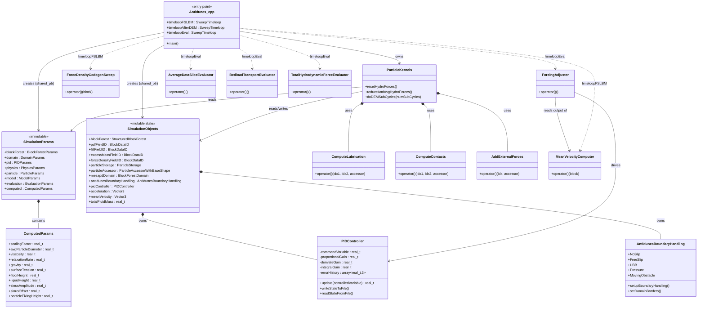
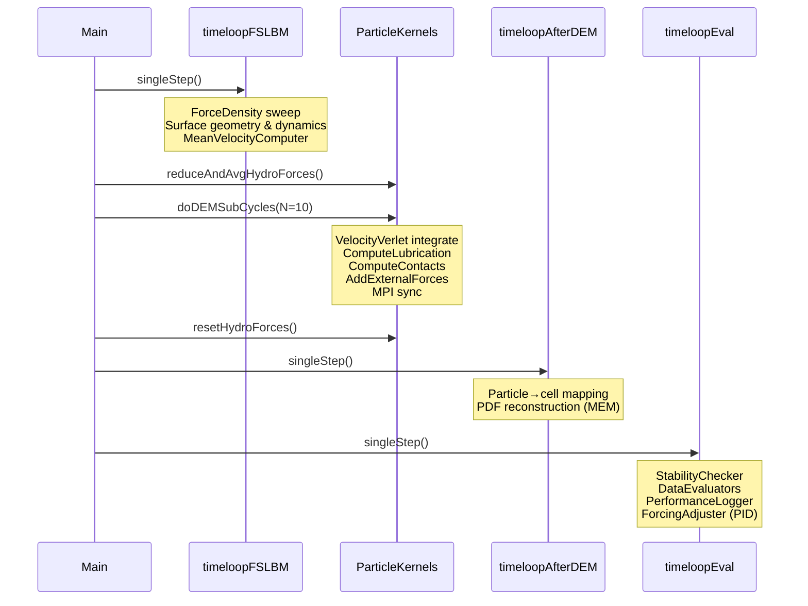

# Antidunes Class Structure

```mermaid
classDiagram

%% ─── Entry point ───────────────────────────────────────────────
class Antidunes_cpp {
    <<entry point>>
    +main()
    +timeloopFSLBM : SweepTimeloop
    +timeloopAfterDEM : SweepTimeloop
    +timeloopEval : SweepTimeloop
}

%% ─── Configuration (immutable after construction) ──────────────
class SimulationParams {
    <<immutable>>
    +blockForest : BlockForestParams
    +domain : DomainParams
    +pid : PIDParams
    +physics : PhysicsParams
    +particle : ParticleParams
    +model : ModelParams
    +evaluation : EvaluationParams
    +computed : ComputedParams
}

class ComputedParams {
    +scalingFactor : real_t
    +avgParticleDiameter : real_t
    +viscosity : real_t
    +relaxationRate : real_t
    +gravity : real_t
    +surfaceTension : real_t
    +floorHeight : real_t
    +liquidHeight : real_t
    +sinusAmplitude : real_t
    +sinusOffset : real_t
    +particleFixingHeight : real_t
}

%% ─── Runtime state ──────────────────────────────────────────────
class SimulationObjects {
    <<mutable state>>
    +blockForest : StructuredBlockForest
    +pdfFieldID : BlockDataID
    +fillFieldID : BlockDataID
    +excessMassFieldID : BlockDataID
    +forceDensityFieldID : BlockDataID
    +particleStorage : ParticleStorage
    +particleAccessor : ParticleAccessorWithBaseShape
    +mesapdDomain : BlockForestDomain
    +antidunesBoundaryHandling : AntidunesBoundaryHandling
    +pidController : PIDController
    +acceleration : Vector3
    +meanVelocity : Vector3
    +totalFluidMass : real_t
}

%% ─── PID flow control ───────────────────────────────────────────
class PIDController {
    -commandVariable : real_t
    -proportionalGain : real_t
    -derivateGain : real_t
    -integralGain : real_t
    -errorHistory : array~real_t,3~
    +update(controlledVariable) real_t
    +writeStateToFile()
    +readStateFromFile()
}

%% ─── Boundary handling ──────────────────────────────────────────
class AntidunesBoundaryHandling {
    +NoSlip
    +FreeSlip
    +UBB
    +Pressure
    +MovingObstacle
    +setupBoundaryHandling()
    +setDomainBorders()
}

%% ─── DEM particle kernels ───────────────────────────────────────
class ParticleKernels {
    +resetHydroForces()
    +reduceAndAvgHydroForces()
    +doDEMSubCycles(numSubCycles)
}

class ComputeLubrication {
    +operator()(idx1, idx2, accessor)
}

class ComputeContacts {
    +operator()(idx1, idx2, accessor)
}

class AddExternalForces {
    +operator()(idx, accessor)
}

%% ─── Forcing / flow driving ─────────────────────────────────────
class ForceDensityCodegenSweep {
    +operator()(block)
}

class MeanVelocityComputer {
    +operator()(block)
}

class ForcingAdjuster {
    +operator()()
}

%% ─── Evaluators ─────────────────────────────────────────────────
class AverageDataSliceEvaluator {
    +operator()()
}

class BedloadTransportEvaluator {
    +operator()()
}

class TotalHydrodynamicForceEvaluator {
    +operator()()
}

%% ─── Relationships ──────────────────────────────────────────────

Antidunes_cpp --> SimulationParams : creates (shared_ptr)
Antidunes_cpp --> SimulationObjects : creates (shared_ptr)
Antidunes_cpp --> ParticleKernels : owns

SimulationParams *-- ComputedParams : contains

SimulationObjects *-- PIDController : owns
SimulationObjects *-- AntidunesBoundaryHandling : owns

ParticleKernels --> SimulationParams : reads
ParticleKernels --> SimulationObjects : reads/writes
ParticleKernels *-- ComputeLubrication : uses
ParticleKernels *-- ComputeContacts : uses
ParticleKernels *-- AddExternalForces : uses

ForcingAdjuster --> PIDController : drives
ForcingAdjuster --> MeanVelocityComputer : reads output of

Antidunes_cpp ..> AverageDataSliceEvaluator : timeloopEval
Antidunes_cpp ..> BedloadTransportEvaluator : timeloopEval
Antidunes_cpp ..> TotalHydrodynamicForceEvaluator : timeloopEval
Antidunes_cpp ..> ForceDensityCodegenSweep : timeloopFSLBM
Antidunes_cpp ..> MeanVelocityComputer : timeloopFSLBM
Antidunes_cpp ..> ForcingAdjuster : timeloopEval
```

## Execution order per timestep

```mermaid
sequenceDiagram
    participant Main
    participant FSLBM as timeloopFSLBM
    participant PK as ParticleKernels
    participant AfterDEM as timeloopAfterDEM
    participant Eval as timeloopEval

    Main->>FSLBM: singleStep()
    Note over FSLBM: ForceDensity sweep<br/>Surface geometry & dynamics<br/>MeanVelocityComputer
    Main->>PK: reduceAndAvgHydroForces()
    Main->>PK: doDEMSubCycles(N=10)
    Note over PK: VelocityVerlet integrate<br/>ComputeLubrication<br/>ComputeContacts<br/>AddExternalForces<br/>MPI sync
    Main->>PK: resetHydroForces()
    Main->>AfterDEM: singleStep()
    Note over AfterDEM: Particle→cell mapping<br/>PDF reconstruction (MEM)
    Main->>Eval: singleStep()
    Note over Eval: StabilityChecker<br/>DataEvaluators<br/>PerformanceLogger<br/>ForcingAdjuster (PID)
```
